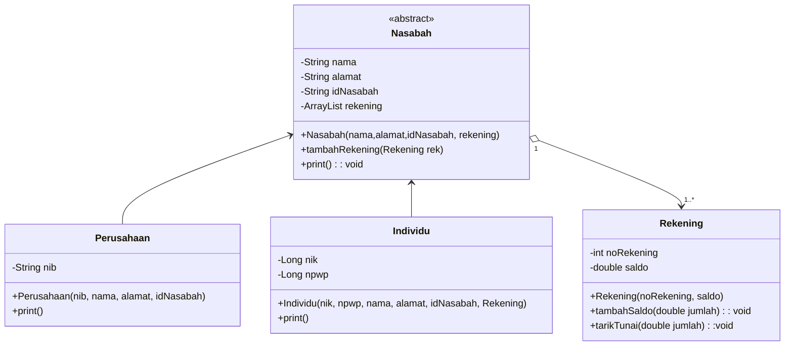

# UAS_PBO
M YAZKA AFFAN F -  2017051013
SITI NABILA -2057051006
NUR SETIOWATI -  2017051013


Pembagian Tugas :

M YAZKA AFFAN F: Membuat Class Diagram dan ER Diagram sesuai yang ada dalam project
NUR SETIOWATI: Menginisialisasi dan mengembangkan class yang digunakan dalam project,Membuat dan menghubungkan program dengan database MySQL
SITI NABILA : Mendesain dan membuat GUI menggunakan JafaFX dan Scene Builder

Class Diagram :

ER Diagram :
 ```mermaid  
  erDiagram
          Nasabah ||--|| Perusahaan : is
          Nasabah ||--|| Individu : is
          Nasabah ||--|{ Rekening : have
          
          REKENING{
                int noRekening
                double saldo
                int id_nasabah
            }

            Nasbaah {
                int idNasabah
                string nama
                string alamat
            }
            
            INDIVIDU{
                int id_nasabah
                long nik
                long npwp
            }
            PERUSAHAAN{
                int id_nasabah
                string nib
            }
```
